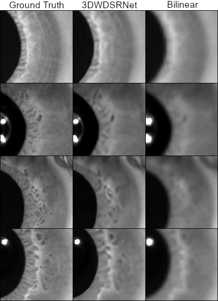

# Iris Multi-Frame Super-Resolution

In this project I implemented the 3DWDSRNet model architecture with the purpose of performing Super-Resolution on Iris image sequences.

The model was implemented using PyTorch and was trained on the Vimeo90K dataset, while for testing I used the LAVI DB2 iris dataset.

